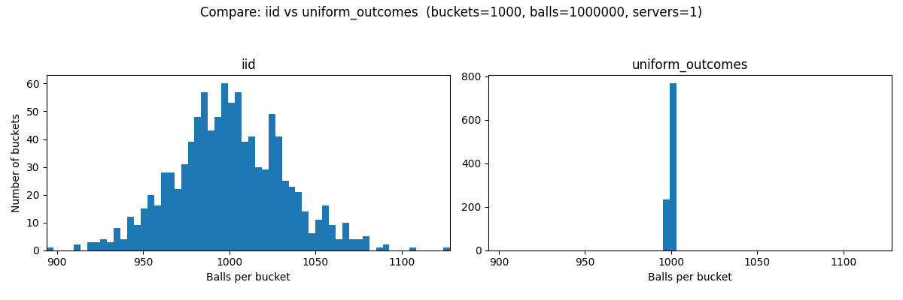
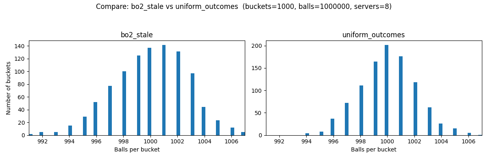

# Uniform Outcomes

**Mean-reverting randomness for near-uniform outcomes in balls-in-bins.**

This repo shows a simple idea: *random placement isn’t the problem — memorylessness is.*  We keep randomness, but softly bias it against **residual imbalance**, so outcomes stay close to uniform even with multiple schedulers and stale local state while avoiding any pathologically correlated behavior such as focus-firing on empty bins.

---

### IID random vs uniform-outcomes (same x-axis)



*Example: 1,000 buckets, 1,000,000 balls — same x-axis*


### Po2 with stale local state vs uniform-outcomes (8 schedulers)



*Both run with 8 independent schedulers/routers. Po2 degrades with staleness; fairness-biased is designed for it.*

---

## The Algorithm

Let `c_i` be the number of placements to bucket `i`.

Define:
- `b = min_i c_i` (baseline / “cleared rows”)
- `e_i = c_i − b` (excess / “tower height”)

Sample the next bucket with probability:

```text
P(i) ∝ exp(−β · e_i)
```


Properties:
- Buckets on the floor `(e_i = 0)` are favored.
- Taller buckets are exponentially downweighted.
- No bucket is ever banned (probabilities never hit zero).
- `β` controls how aggressively we suppress towers (`β = 0` ⇒ IID uniform).

This is random, but not i.i.d. It’s a mean-reverting process: random placement with a conscience if you will.

## Repo Layout

```text
src/uniform_outcomes/
  uniform_outcome_randomizer.py       # reference / executable spec (intentionally O(k))
  fast_uniform_outcome_randomizer.py  # fast sketch (level sampling + lazy baseline)

simulations/
  __init__.py     # package marker
  common.py       # shared dataclasses + stats helpers
  methods.py      # iid / bo2 / bo2_stale / fair
  run.py          # run_experiment()
  compare.py      # compare two methods + plot (same x-axis)
```

## Simulations

### Install
From repo root

```bash
pip install -e .
```

### Compare two methods

```bash
$ python -m simulations.compare --method-a iid --method-b uniform_outcomes --buckets 1000 --balls 1000000 --servers 8
$ python -m simulations.compare --method-a bo2 --method-b iid --buckets 1000 --balls 1000000 --servers 1
$ python -m simulations.compare --method-a bo2_stale --method-b uniform_outcomes --buckets 1000 --balls 1000000 --servers 8
```

Supported methods:
- iid — IID uniform placement
- bo2 — power-of-two with fresh global feedback
- bo2_stale — power-of-two with stale local state across --servers schedulers
- uniform_outcomes — fairness-biased placement (multi-scheduler) using the fast sketch

Notes:
- --servers models independent schedulers/routers.
- bo2 ignores --servers (fresh global feedback makes multi-router equivalent to one).
- fair uses `β = 1.0` internally (fixed on purpose to keep the tool simple).

## When should I consider?

This is most interesting when:
- you have many schedulers/routers
- you want to keep placements random and un-correlated (vs simpler algorithms like round robin)
- shared state is stale, expensive, or undesirable
- you want near-uniform outcomes without coordination
- workloads are roughly homogeneous

Not a great fit when:
- tasks are highly heterogeneous (placement needs richer signals)
- strict per-task SLAs demand tighter controls than probabilistic nudges
- coordination is cheap and you can do power-of-two with fresh load cheaply

## License
MIT